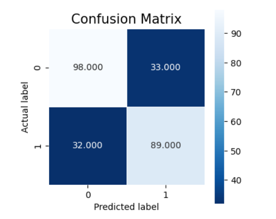
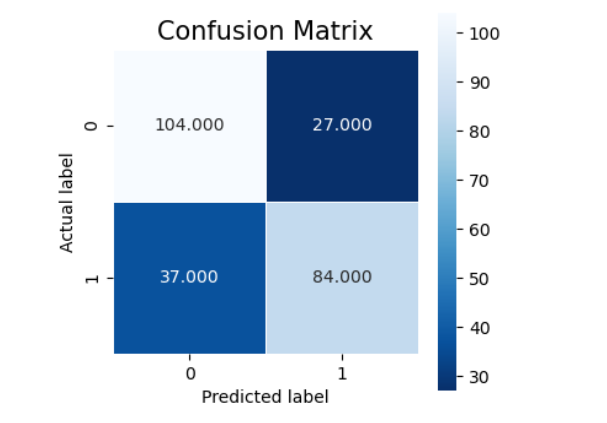
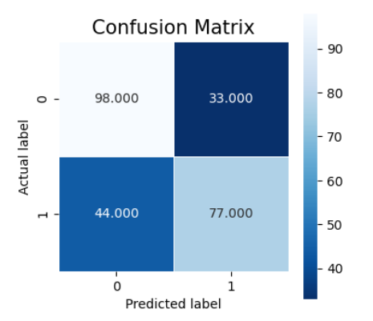
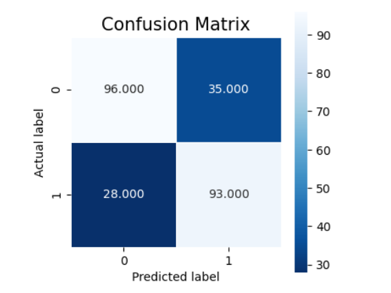

# Mental-Health-Prediction-Using-Machine-Learning

A Comparative Study of Machine Learning and Ensemble Learning Algorithms

---

# INTRODUCTION

In today’s fast-paced world, mental health remains a critical yet often under-addressed issue. Psychological conditions such as anxiety, depression, and stress have become increasingly prevalent, particularly in high-pressure sectors like the technology industry. Early identification of mental health risks allows for timely intervention, improved recovery outcomes, and enhanced quality of life.

Mental health disorders do not arise suddenly; they develop gradually and exhibit identifiable patterns and early-stage indicators. By leveraging machine learning techniques, it becomes possible to analyze behavioral and workplace-related attributes to predict whether an individual may require mental health treatment.

This project aims to evaluate and compare selected machine learning and ensemble learning algorithms in predicting whether an individual working in the technology sector is likely to seek mental health treatment.

The machine learning techniques implemented in this project include:

* Logistic Regression
* Decision Tree Classifier
* Random Forest Classifier
* AdaBoost Classifier

---

# PROPOSED METHODOLOGY

The proposed architecture consists of five major components:

1. **Dataset Description**
2. **Data Preprocessing**
3. **Data Visualization**
4. **Model Building**
5. **Performance Evaluation**

### 1️) Dataset Description

Understanding the dataset structure, features, and target variable.

### 2️) Data Preprocessing

* Handling missing values
* Cleaning inconsistent categorical values
* Label Encoding categorical features
* Feature selection using correlation analysis

### 3️) Data Visualization

* Distribution analysis of key variables
* Feature-to-target relationship analysis
* Correlation heatmap

### 4️) Model Building

Implementation of four machine learning models:

* Logistic Regression (Baseline Linear Model)
* Decision Tree (Non-linear Tree Model)
* Random Forest (Bagging Ensemble)
* AdaBoost (Boosting Ensemble)

### 5️) Performance Analysis

Models were evaluated using:

* Accuracy
* Precision
* Recall
* F1-Score
* Confusion Matrix
* Cross-validation

---

# DATASET DESCRIPTION

The dataset used in this project is the **Mental Health in Tech Survey**, publicly available on Kaggle.

🔗 Dataset Source:
[https://www.kaggle.com/datasets/osmi/mental-health-in-tech-survey](https://www.kaggle.com/datasets/osmi/mental-health-in-tech-survey)

The dataset was collected by **Open Sourcing Mental Illness (OSMI)** and contains survey responses from approximately 1,900 individuals working in the technology sector.

It consists of 27 columns including:

* Age
* Gender
* Family History
* Self-Employment Status
* Work Interference
* Remote Work
* Company Type
* Benefits Provided
* Workplace Support
* Mental Health Consequences
* Target Variable: `treatment`

The target variable indicates whether the individual has sought treatment for mental health conditions.

---

# FEATURE ENCODING

Machine learning models require numerical inputs. Therefore, categorical variables were transformed into numerical form using **Label Encoding**.

Encoded features include:

* Age
* Gender
* self_employed
* family_history
* treatment
* work_interfere
* remote_work
* tech_company
* benefits
* care_options
* wellness_program
* seek_help
* anonymity
* leave
* mental_health_consequence
* phys_health_consequence
* coworkers
* supervisor
* mental_health_interview
* phys_health_interview
* mental_vs_physical
* obs_consequence

---

# DATA VISUALIZATION

Exploratory Data Analysis was performed to understand feature distributions and relationships with the target variable.

Key observations include:

* Individuals with a family history of mental health issues were more likely to seek treatment.
* Work interference strongly correlated with treatment.
* Many employees reported limited workplace discussions about mental health.
* A large number of respondents had never undergone a mental health interview at work.

Visualization techniques used:

* Countplots
* Bar plots
* Correlation heatmap
* Confusion matrices

---

# MODELS IMPLEMENTED

## 1️) Logistic Regression

* Linear baseline model
* Provides interpretable classification boundary

## 2️) Decision Tree Classifier

* Captures non-linear feature interactions
* Tuned using max_depth and min_samples_split

## 3️) Random Forest Classifier

* Ensemble of decision trees (Bagging)
* Reduces overfitting
* Improves stability

## 4️) AdaBoost Classifier

* Boosting-based ensemble
* Focuses on misclassified samples
* Achieved highest recall and lowest false negatives

---

# RESULTS

Below is the comparative performance of the implemented models.

<table>
  <tr>
    <td align="center">
      <b>Decision Tree</b> 
      
    </td>
    <td align="center">
      <b>Random Forest</b> 
      
    </td>
  </tr>
  <tr>
    <td align="center">
      <b>Logistic Regression</b> 
      
    </td>
    <td align="center">
      <b>AdaBoost</b> 
      
    </td>
  </tr>
</table>

### Performance Metrics Used:

* Accuracy
* Precision
* Recall
* F1-Score

AdaBoost demonstrated superior recall performance, which is crucial in this application since minimizing False Negatives is important when identifying individuals potentially at risk.

---

# CONCLUSION

This project presented a machine learning-based approach to classify whether individuals working in the technology sector are likely to seek mental health treatment.

Key conclusions:

* Logistic Regression served as an effective baseline model.
* Decision Tree captured non-linear relationships but showed slight overfitting.
* Random Forest improved generalization through bagging.
* AdaBoost achieved the best balance between precision and recall.
* Minimizing False Negatives was prioritized, and AdaBoost performed best in this regard.

